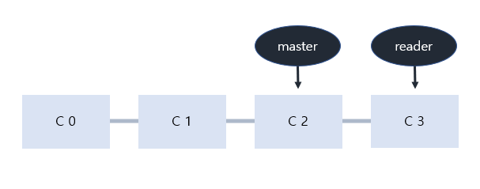
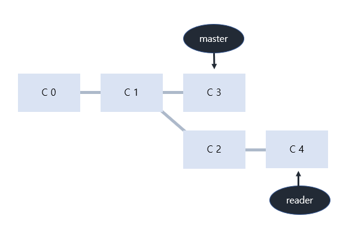
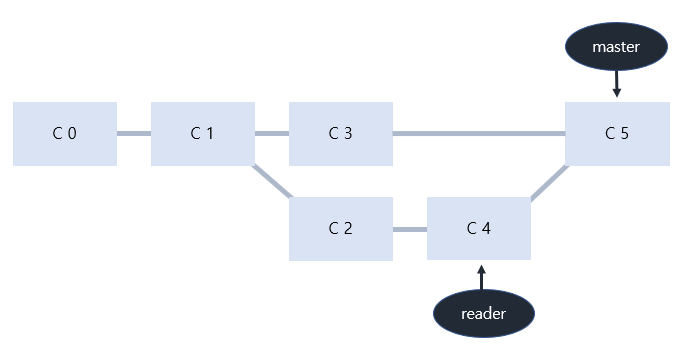

# TIL 정리하기

> 깃허브 특강 3일 중 3일차 기록. 송채원.
>
> Git reset, revret, branch에 대해 학습함.

## Git reset

> 이전 커밋으로 되돌아가기!

#### [1] git reset

- `git reset [옵션] <커밋 ID>`의 형태로 사용한다. 

- __시계바늘을 돌리는 행위__처럼 특정 커밋 상태로 되돌아간다. 

- 따라서 해당 커밋 __이후로 쌓인 커밋들은 전부 사라진다.__

- 옵션은 세 종류!

  1. `--soft` 

     - 돌아가려는 커밋으로 되돌아감
     - 이후로 커밋된 파일들은 `staging area`로 돌아감. 즉, __커밋하기 전의 상태__

  2. `--mixed`

     - 돌아가려는 커밋으로 되돌아감
     - 이후로 커밋된 파일들을 `working directory`로 돌려놓음. 즉, `add`하기 전의 unstage된 상태가 됨. 
     - 옵션을 정해주지 않았을 때의 __디폴트값__임

  3. `--hard`

     - 돌아가려는 커밋으로 되돌아감

     - 이후로 커밋된 파일들이 모두 `working directory`에서 삭제됨.

     - 단, _Untacked 파일은 Untracked로 남음_

     - __복구하는 방법__은 __`git reflog`__를 사용하면 된다. 

       --> `git reflog`를 사용하면 쌓인 모든 커밋 내역을 보여준다. 즉, Git에는 __삭제라는 개념이 없다__! 삭제한다는 행위 자체도 모두 __저장__하는 것. 

     - `git reflog` 실행 후 돌아가고 싶은 커밋 ID에 대해 `git reset --hard`를 진행하면 된다. 

## Git revert

> git reset은 쉽게 과거로 돌아갈 수 있지만, 커밋 내역이 사라진다는 단점이 있다. 따라서 협업시에 커밋 내역의 차이로 인한 충돌이 발생할 수 있다. 이 때, `git revert`를 사용할 수 있다. 

#### [1] git revert

- `git revert <commit ID>`의 형태로 사용.
- __특정 사건을 없었던 일로 만드는 행위__로 __이전 커밋을 취소한다는 새로운 커밋을 수행__한다. 
- 즉, `커밋 내역을 삭제하는 git reset`과 달리 `새로 커밋을 쌓는다`는 차이가 있다. 

---

__<<< 주의! >>>__

`git reset`과 `git revert`의 혼동이 있을 수 있다!

`git reset --hard @@@`라고 작성하는 것은 @@@라는 커밋__으로__ 돌아간다는 뜻이고, `git revert @@@`라고 작성하는 것은 @@@라는 커밋__을__ 되돌린다는 뜻이다!

----

## Git branch

#### [1] Branch란?

- Branch란 나뭇가지처럼 여러 갈래로 작업 공간을 나누어 __독립적으로 작업__할 수 있도록 도와주는 도구이다. 
- __장점__
  - 독립 공간을 형성하기 때문에 __원본(master)은 안전__하다.
  - 하나의 작업은 하나의 브랜치로 나누어 진행되므로 체계적인 개발 가능.
  - 특히 Git은 브랜치를 만드는 속도가 빠르고, 용량도 적게 든다. 

#### [2] git branch

> 브랜치 조회, 생성, 삭제 등 브랜치와 관련된 Git 명령어

1. 브랜치 목록 확인
   - `git branch`
2. 원격 저장소의 브랜치 목록 확인
   - `git branch -r`
3. 새로운 브랜치 생성
   - `git branch <브랜치 이름>`
4. 특정 커밋 기준으로 브랜치 생성
   - `git branch <브랜치 이름> <commit ID>
5. 특정 브랜치 삭제
   - `git branch -d <브랜치 이름>` : 병합된 브랜치만 삭제 가능
   - `git branch -D <브랜치 이름>` : 강제 삭제. 병합되지 않은 브랜치도 삭제 가능. 

#### [3] git switch

> 현재 브랜치에서 다른 브랜치로 `HEAD`를 이동시키는 명령어. `HEAD`란 현재 브랜치를 가리키는 포인터를 의미. 

1. 다른 브랜치로 이동
   - `git switch <다른 브랜치 이름>`
2. 브랜치를 새로 생성함과 동시에 이동
   - `git switch -c <브랜치 이름>`
3. 특정 커밋 기준으로 브랜치 생성과 동시에 이동
   - `git switch -c <브랜치 이름> <commit ID>`

** Git의 브랜치는 독립적인 작업 공간을 가지지만, 어디까지나 Git이 관리하는 파일 트리에 한해서이다. 따라서 add하지 않아 Staging Area에 올라가지 않은 새 파일은 Git의 관리가 적용되지 않는다. 따라서! __git switch를 하기 전에 반드시 모든 워킹 디렉토리의 파일이 버전 관리가 되고 있는지 확인__해야 한다. 

** 브랜치를 이동한다는 것은 HEAD가 해당 브랜치를 가리킨다는 것을 의미한다. 따라서 워킹 디렉토리의 내용은 HEAD가 가리키는 해당 브랜치의 최신 커밋 상태로 변화한다. 

---

## Branch Merge

> 각 브랜치에서의 작업이 끝난 뒤, master 브랜치에 반영하려면?

#### [1] git merge

- 분기된 브랜치들을 하나로 합치는 명령어.
- `git merge <합칠 브랜치명>`의 형태로 사용한다.
- __Merge하기 전에 병합의 주가 되는 메인 브랜치로 switch해야 한다.__
- 즉, branch1이라는 브랜치를 branch2에 합치기 위해서는 branch2로 switch해야 한다는 것이다. 

#### [2] Merge의 종류

__1. Fast-Forward__

- 브랜치를 병합할 때 마치 _빨리감기_처럼 브랜치가 가리키는 커밋을 앞으로 이동시키는 것이다. 
- 사례로 알아보기: 
- master 브랜치는 C2 커밋을, reader 브랜치는 C3 커밋을 가리키고 있는 상황
  - 이때, master에 reader를 병합하면, reader가 가리키는 C3 커밋은 C2에 기반한 커밋이므로 master가 C4로 이동한다. 
  - 이렇게 따로 merge 과정 없이 브랜치의 포인터가 이동하는 것이 __Fast-Forward__ 방식이다. 

__2. 3-Way Merge__

- 브랜치를 병합할 때 __각 브랜치의 커밋 두 개와 공통 조상 하나__를 사용하여 병합하는 것이다. 
- 두 브랜치에서 __다른 파일__ 혹은 __같은 파일의 다른 부분__을 수정했을 때 가능한 방식. 
- 사례로 알아보기:

- master는 C3 커밋을, reader C4 커밋을 가리키고 있는 상황.
  - 두 브랜치의 공통 조상은 C1 커밋이다. 
  - 이 때 master에 reader를 병합하면 두 브랜치는 갈래가 나누어져 있기 때문에 Fast-Forward로 합쳐질 수 없다. 따라서 공통 조상인 C1와 각자가 가리키는 커밋인 C3, C4를 비교하여 3-way merge를 진행한다. 

- 새로 쌓인 C5 커밋은 master와 reader가 병합되면서 발생한 Merge Commit이다. 

__3. Merge Conflict__

- 병합하는 두 브랜치에서 __같은 파일의 같은 부분__을 수정한 경우, Git이 어느 브랜치의 내용으로 작성해야 하는지 판단하지 못해서 발생하는 충돌(conflict) 현상이다. 
- 사용자가 직접 내용을 선택하여 충돌을 해결해야 한다. 
  - 충돌이 일어난 파일을 확인하기 위해 `git status` 입력.
  - 충돌이 일어난 파일이 carat.txt 라고 하자. 해당 파일을 열면 충돌 내역을 볼 수 있다. 
  - `=======` 왼쪽과 같이 생긴 가로선을 기준으로 각 브랜치에서 수정된 부분의 내용을 확인할 수 있다. 이 중 __하나를 선택하거나 둘 모두를 선택할 수도 있고, 아예 새롭게 작성할 수도 있다.__ 
  - 이후 `git add`와 `git commit`으로 병합한 내용을 커밋한다. 
  - Vim 편집기를 이용하여 커밋 내역을 수정할 수 있고, 그렇게 작성한 커밋이 다음 커밋이 된다. 

---

---

---

_Git에 관련된 강좌를 더 많이 들어보고 싶다. 강사님께서 추천해주신 유튜브 영상 강의부터 차근차근 들어보면 도움이 많이 될 것 같다. 가장 중요한 건 일단 Git을 직접 꾸준히 사용하면서 감을 잃지 않는 것이 아닐까?_

